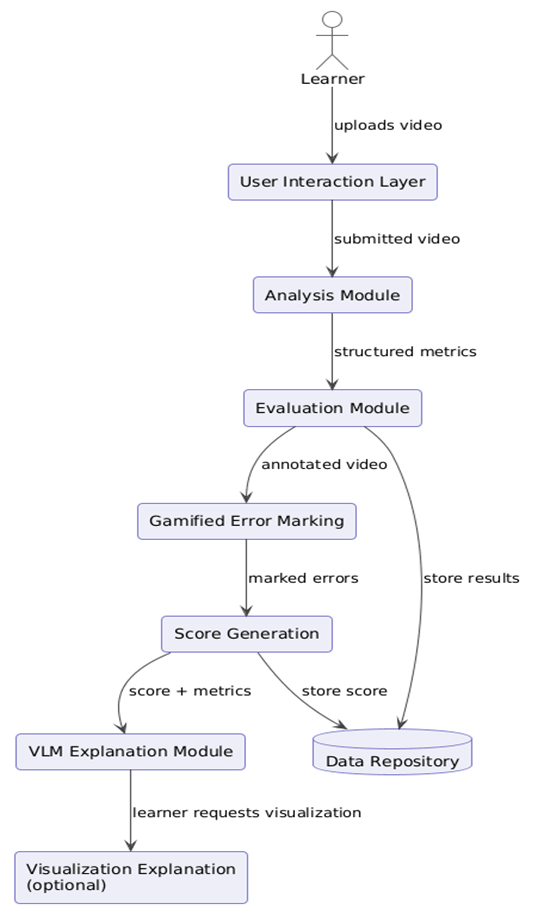
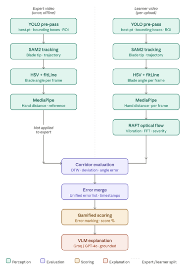
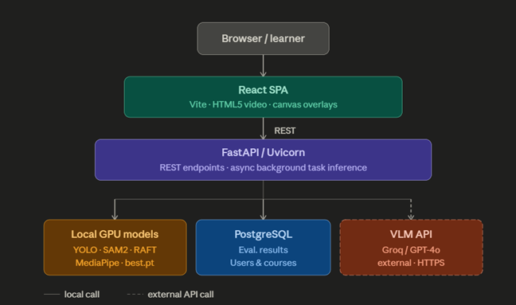
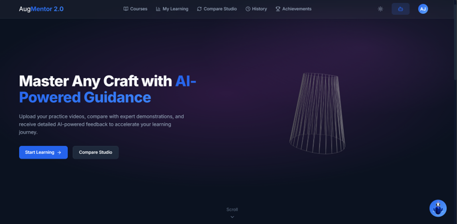
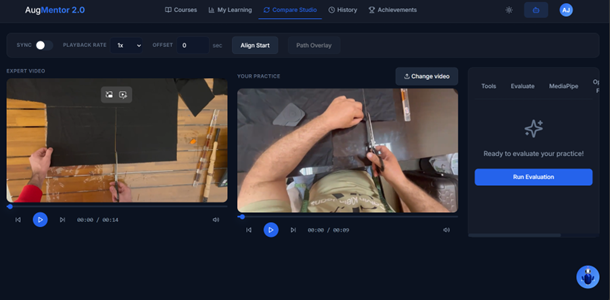
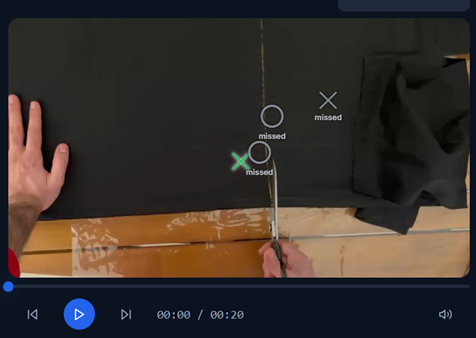
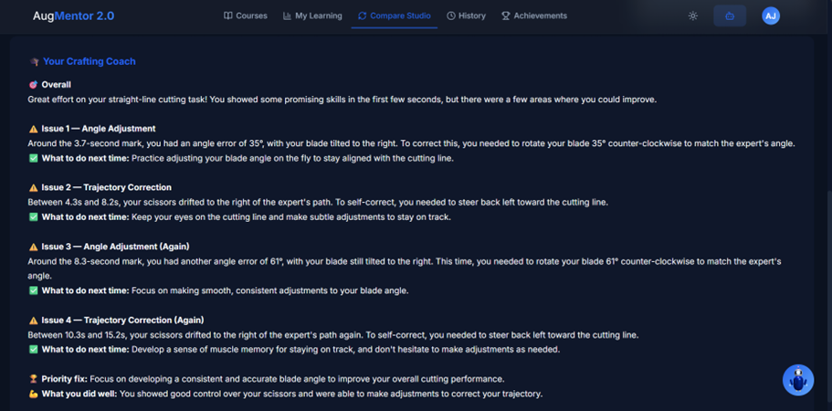
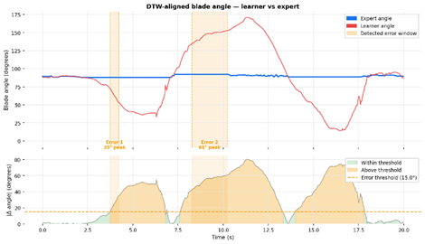
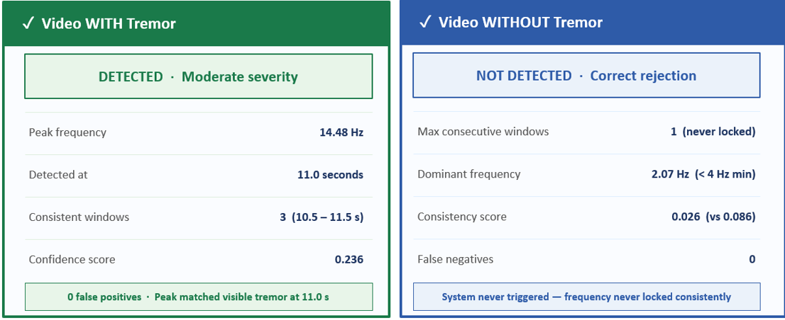
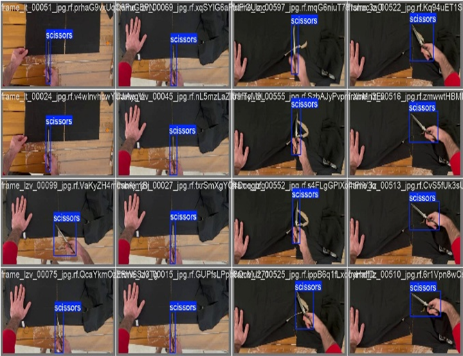

# AugMentor 2.0
**Vision–Language–Action Framework for Egocentric Craft Skill Evaluation**

AugMentor 2.0 is an AI-powered web platform that evaluates a learner's craft practice video against an expert reference and delivers structured, personalised feedback — without requiring the expert to be present.

The system processes egocentric videos through a computer vision and signal processing pipeline that tracks the cutting tool frame by frame, measures deviations in trajectory, blade angle, and vibration, and generates natural-language explanations grounded in computed metrics.

Developed as a Final Year Project in Computer & Communications Engineering at École Supérieure d'Ingénieurs de Beyrouth — Université Saint-Joseph de Beyrouth, in collaboration with Mines Paris – PSL University.

---

## How It Works



The system compares two videos:

- **Expert video** — a reference recording of the correct technique
- **Learner video** — the student's practice attempt

The evaluation pipeline runs automatically on upload:

1. **Tool detection** across all frames (custom YOLOv8s)
2. **Blade tip tracking** and trajectory extraction (SAM2 Hiera-Tiny)
3. **Blade angle estimation** per frame (HSV masking + fitLine + DTW alignment)
4. **Vibration detection** via optical flow frequency analysis (RAFT + windowed FFT)
5. **Hand-to-tool distance** estimation (MediaPipe)
6. **Error detection and localisation** — trajectory drift, angle deviation, and vibration events timestamped and spatially bounded
7. **Annotated video output** with corridor overlays and error markers
8. **AI-generated feedback** — plain-language coaching grounded in measured deviations (metric-constrained VLM)



The learner then interacts with their results through a **gamified interface** that challenges them to identify their own errors before the system reveals the full evaluation and score.

---

## Application Stack



| Layer | Technology |
|---|---|
| Frontend | React SPA (Vite) |
| Backend | FastAPI + Uvicorn |
| Database | PostgreSQL |
| Tool Detection | YOLOv8s (custom fine-tuned, `best.pt`) |
| Blade Tracking | SAM2 Hiera-Tiny |
| Angle Estimation | OpenCV HSV + fitLine + DTW |
| Vibration Detection | RAFT optical flow + windowed FFT |
| Hand Detection | MediaPipe Hands |
| Video Processing | OpenCV + FFmpeg |
| VLM Feedback | Groq Llama-4 Scout (dev) / GPT-4o (production) |

GPU (CUDA) is required. SAM2 tracking alone exceeds 600 seconds per video without a GPU.

---

## Interface





 




---

## Getting Started

### Prerequisites

- Python 3.10+
- NVIDIA GPU with CUDA 11.4+
- PostgreSQL
- Node.js 18+

### Backend

```bash
cd backend
pip install -r requirements.txt
uvicorn app.main:app --reload --port 8001
```

The frontend dev server proxies `/api` and `/storage` to `http://localhost:8001` by default. If you use a different port, set `AUGMENTOR_API_TARGET` in the frontend environment.

### Frontend

```bash
cd frontend
npm install
npm run dev
```

### Model Weights

Place the following weight files in the configured model directory:

- `best.pt` — custom YOLOv8s scissors detector (fine-tuned on 584 egocentric images)
- `sam2_hiera_tiny.pt` — SAM2 Hiera-Tiny tracker
- RAFT weights are downloaded automatically via torchvision on first run

---

## Database

### Setup

```bash
createdb augmentor_db
python -m app.scripts.init_db
```

### Recovery

If DB rows are lost but files still exist under `backend/storage`:

```bash
# Audit only (read-only)
python -m app.scripts.recover_storage_registry

# Re-register recoverable expert rows
python -m app.scripts.recover_storage_registry --apply --create-missing-chapters
```

Recovery only re-registers expert records when the source video file still exists on disk. Learner run folders are audit-only.

### Testing

Pytest requires `TEST_DATABASE_URL` and refuses to run if it matches the app `DATABASE_URL`.

```bash
set TEST_DATABASE_URL=postgresql+psycopg://<user>:<password>@localhost:5432/augmentor_test_db
pytest
```

---

## Performance

Measured on an 18-second learner video at 30 fps (NVIDIA RTX 3060 Laptop, 6 GB VRAM):


| Stage | Runtime |
|---|---|
| YOLO pre-pass | 18.1s |
| SAM2 tracking + trajectory | 47.4s |
| HSV angle estimation + DTW | 19.4s |
| RAFT vibration detection | ~7.0s |
| MediaPipe hand distance | ~5.0s |
| Error detection + merge | <0.1s |
| **Total** | **~97s** |

Expert videos are pre-processed once at registration time. Per-evaluation runtime covers the learner video only.

---

## Validation Results





| Component | Result |
|---|---|
| YOLOv8s mAP@0.5 | 0.995 |
| YOLOv8s F1 | 1.00 |
| SAM2 tracking coverage | 100% |
| Vibration detection accuracy | 100% (4/4 test videos) |
| End-to-end stress test errors detected | 4/4 |



---
## Documentation

The full technical report is available [here](docs/FYP41_CCE_final_report_Ali_Ahmad_Rafic.pdf).

## Contributors

**Students**
- Ali Azzam
- Ahmad Dia
- Rafic Dergham

**Supervisors**
- Dr. Alina Glushkova — Mines Paris – PSL University
- Dr. Juliana El Rayess — USJ — École Supérieure d'Ingénieurs de Beyrouth 

---

## Academic Context

Final Year Project — Computer & Communications Engineering  
École Supérieure d'Ingénieurs de Beyrouth, Université Saint-Joseph de Beyrouth  
May 2026
